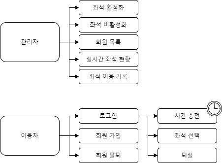

# StudyCafeSeatManager
## 목차
**1. 개발 목적**   
**2. 개발 환경**   
**3. 시스템 개요**     
**4. 시스템 flow-chart**     
**5. 테이블 구조**     
**6. 시스템 시연**     
**7. 시스템 구현 주요사항**     
**8. 리뷰**   

## 1. 개발 목적
- 스터디 카페에 별도의 상주 인원 없이 무인으로 관리하기 위한 프로그램.
- 관리자는 어디서든 이 프로그램을 통해 좌석 활성화/비활성화할 수 있다.
- 이용자는 스터디 카페 내에 있는 기계를 통해 회원 가입, 시간 충전, 좌석 이용, 퇴실, 탈퇴할 수 있다.
## 2. 개발 환경
- JAVA 8, Oracle Database 11g Express Edition Release 11.2.0.2.0 - 64bit Production
- Tool: eclipse IDE 2020-12, Oracle SQL Developer
## 3. 시스템 개요
- 관리자는 관리자 페이지에서 서비스할 좌석을 활성화한다.
- 이용자는 정보 등록 후 시간 충전, 좌석 선택하여 좌석을 이용한다.
- 이용 시간이 남아있다면 이용자는 로그인 후 스스로 퇴실 가능.   
퇴실 시 남은 시간은 저장되고, 추후 다시 로그인 시 남은 시간으로 좌석 이용 가능.
- 이용 시간이 만료되면 자동 퇴실 처리, 해당 회원의 남은 시간은 0으로 초기화된다.
- 회원 탈퇴 시 모든 기록은 삭제된다. 남은 시간도 모두 사라진다.
- 좌석 이용 기록이 7일간 보관됨.
## 4. 시스템 flow-chart

## 5. 테이블 구조
## 6. 시스템 시연
- 직접 외부 시연
## 7. 시스템 구현 주요사항
1. 이용 시간이 만료되면 자동 퇴실 처리하기 위해, 1분 간격으로 
좌석 이용 중인 고객의 이용 시간을 확인한다. 이용 시간이 남은 시간보다
클 경우 퇴실 처리.
2. 퇴실 시 자동으로 이용 기록이 저장되고, 7일이 경과하면 자동으로 삭제된다.
3. 이용자 편의를 위해 회원 가입/비회원 가입 두 가지 방법으로 이용할 수 있도록 구현
## 8. 리뷰
- 프로그램 이용자가 입력하는 input 값의 유효성 검사 부족
  - 프로그램 이용 시 정해진 type의 input 외에 다른 type의 input이 입력될 경우
정상 작동 안 될 수도 있음. 
- 회원 가입 시 입력 데이터의 포맷을 정하지 않음.
  -아이디 입력란에 한글, 이메일 입력란에 @ 없이 입력 등등, 정규 표현식에 맞지 않는 데이터 입력 가능성 있음
